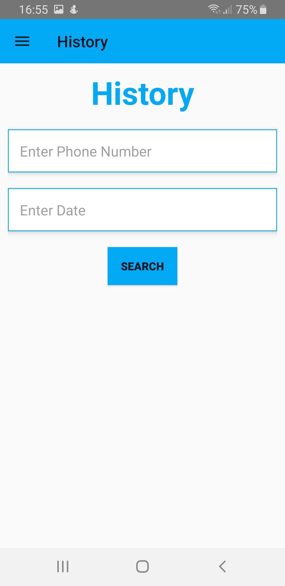

# SpyApp - Mobile Security Final Project Part 2
An application used to spy on user's location and activity, built with Java in Android Studio.

SpyApp offers three main functions:
1. Tracking user's live location and his activity (standing, walking, running or in vehicle).

   

2. Get user's activities history and details for each activity, like: start and end time, route.

       

3. Watch activities hot zones.

  
